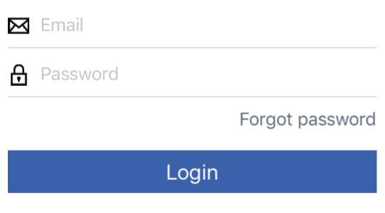

# react-native-simple-login

> Login component for react-native

[](http://standardjs.com/) [](https://travis-ci.org/Vizir/react-native-simple-login)
[](https://codeclimate.com/github/Vizir/react-native-simple-login)
[](https://codeclimate.com/github/Vizir/react-native-simple-login/coverage)
[](https://codeclimate.com/github/Vizir/react-native-simple-login)

## Install

```bash

npm install --save react-native-simple-login

```

## Usage

```JavaScript

import Login from 'react-native-simple-login'

...

const onLogin = (email, password) => {
  console.log(email, password) // user credentials
}

const onResetPassword = (email) => {
  console.log(email)
}

<Login
  onLogin={onLogin}
  onResetPassword={onResetPassword}
/>

```

Will output:



| Available Properties | Description |
-----------------------|-----------------
| onLogin                                | (required) Function to call when the user tries to login |
| onResetPassword                        | Function to call when the user tries to reset password |
| labels                                 | An object with the labels to use on the component, if a label is missing, the default will be used. Available labels are: rememberMe, userIdentification, password, forgotPassword, loginFormButton, forgotPasswordFormButton, back. Example: `{ userIdentification: 'Email' }` |
| logoImage                              | The image to be used as the logo. Will appear at the top of the login and reset password forms |
| passwordInputIcon | The image to be used as the password input icon |
| showLogoOnLogin | If true, will show the logo image on the login form. Defaults to true. |
| showLogoOnResetPassword | If true, will show the logo image on the reset password form. Defaults to true. |
| userIdentificationInputIcon | The image to be used as the user identification input icon |
| inputPlaceholderTextColor              | Color to use for the input placeholders |
| backButtonStyle                        | Reset password back button style |
| backButtonTextStyle                    | Reset password back button text style |
| baseButtonStyle                        | Base style for the submit buttons |
| baseButtonTextStyle                    | Base style for the submit buttons text |
| loginResetPasswordLinkStyle            | Reset password link style |
| loginResetPasswordLinkTextStyle        | Reset password link text style |
| fieldsetWrapperStyle                   | Form fieldset style |
| inputIconStyle                         | Input icon style |
| inputWrapperStyle                      | Input wrapper style |
| inputStyle                             | Input style |
| loginFormSubmitButtonStyle             | Login form submit button style |
| loginFormSubmitButtonTextStyle         | Login form submit button text style |
| loginFormWrapperStyle                  | Login form wrapper style |
| logoStyle                              | Logo style |
| resetPasswordFormWrapperStyle          | Reset password form wrapper style |
| resetPasswordFormSubmitButtonTextStyle | Reset password form submit button text style |
| resetPasswordFormSubmitButtonStyle     | Reset password form submit button style |

## Contributing

1. Fork this repository
2. Create a branch based on master about what you are doing
  - Names should be separated by hyphen: example-name
3. Commit using the format: \[\<type\>\] \<message\>
  - The type should be: Feat, Fix, Refactor or Docs
  - Example message: \[Docs\] Added contributing to readme
  - Do not forget to add tests!
4. Run all tests `npm test` and linter `npm run lint`
5. Create a pull request describing the changes you made

## License

[MIT](https://opensource.org/licenses/MIT)
